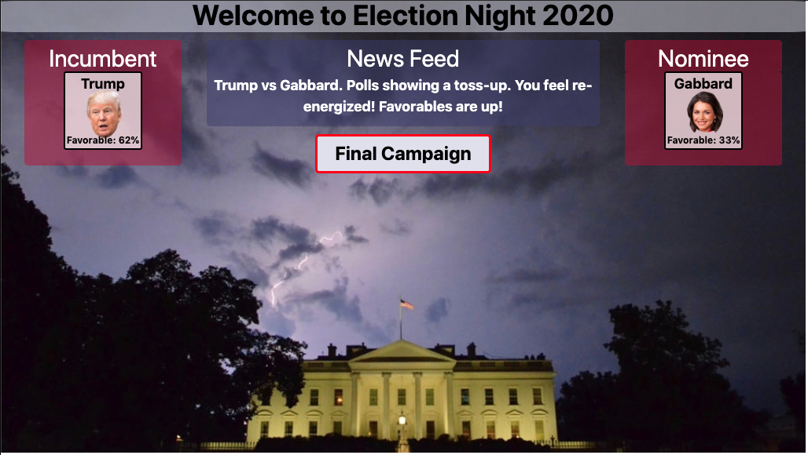

# Political Role Playing Game

Role Playing Game - 2020 Democratic Nomination Campaign

## Description

This is an HTML, CSS, javascript, JQuery(for all dynamic page activity) role playing  style game using the theme of the 2020 Democratic Nomination campaign and 2020 general election as a bonus round.

The player chooses a candidate from eight choices and plays the whole game as that candidate.  The player clicks on candidate images ("badges") to select their candidate and opponents.

One by one the player faces off against the other candidates and campaigns to victory or loss against the current opponent.  If all 7 opponents are defeated the player wins the nomination and advances to the bonus round of the 2020 general election against the sitting president.

A "News Feed" message box provides information and instructions during game play.
The player uses a multi-purpose button to move thru the campaign trail rounds and advance to the general election if possible.  A chance to play again is presented whenever the player has lost - either in the nomination round or general election round. 

## Deployed Page:
https://mylescarey2019.github.io/political-role-play/

## Play Example:

## Screen Captures:

## Getting Started

### Dependencies

* not responsive design, requires viewport of about 1024x576 for best experience 

### Installing

* none necessary - use browser to play

### Executing program

* open in browser and follow "News Feed" instructions
*   1. click on characters to select
    2. use multi-use button for combat and page advance
    3. play again after win or loss
    

## Help

Player badges show current "Favorable" % - this is their "Health" points
Player campaign trail "attack" rating goes up with each head to head round.
When choosing opponent know that low heath character could have a slightly stronger attack rating
and high health character could have slighly weaker attack rating - so there is some variablity.
Road to victory is generally to attack low health opponents first.
But know that a low health character could win the game (sometimes) if played well and chance falls right.          Likewise a high Health character doesn't guarenteed you will make to the general election.

See requirement note in [UseCases and Psuedo Code](UseCases-PsuedoCode.md) for more details

## Authors

Myles Carey 
mylescarey2019@gmail.com 

## Version History

* 0.1
    * Initial Release

## License

## Acknowledgments

Thanks to beta testers - my 15yo & 17yo daughters and wife 
