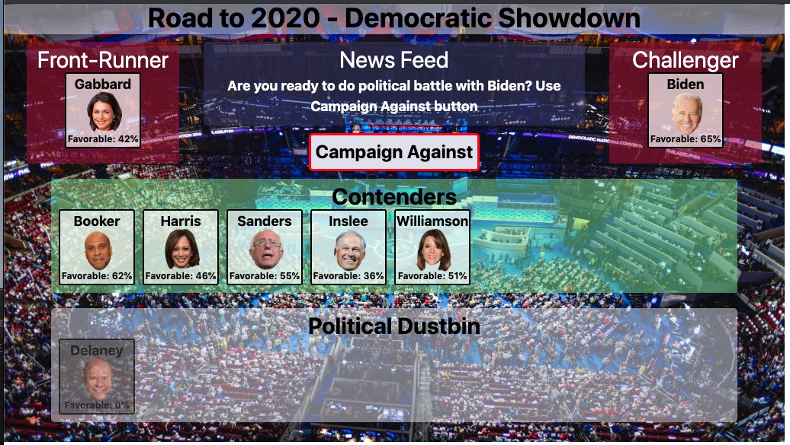

# Project Title

RPG Game - Theme Democratic Candidates

## Description

User picks candidate and battles one by one to win nomination.
(and, coding time permitting, advance to general election round)

## Use Cases

1.  game starts in browser 
    1. page has transparent boxes over background:  Front-Runner, News Feed, Challenger, Contenders, Candidates
        1. 8 candidate badges appear in candidates field at bottom of screen - order will be randomized (if coding time permits)
        2. the candidates will have strength numbers in the form of "Favorable 61%" where percent will relate to "health points"
            1. each candidate has 3 attribute:  health (shown on badge), campaign offensive effectiveness (unseen) and campaign
              defensive effectiveness (unseen) 
            2. the three attributes will be randomizes with ranges:  2 weak candidates, 2 low-mid candidates, 2 mid-high and 2 - high;
              Exact play balance ranges for the attributes is TBD.
        3. badges will have names at top and head image in middle with nice framework and background
        5. new feed will have - message:  Welcome to the Democratic Nomination Race - pick yourself a Candidate to play with by clicking it

2. player clicks candidate
    1. the candidate move from Candidate box to the front-runner box
    2. the remaining candidates move to Contenders box and Candidates box is re-title to "Political Dustbin"
    3. news feeds changes to  "now pick a contender to campaign against"
    4. clicking on own candidate once in front-runner box does nothing
    5. note: the Front-runner does not use their defensive effectiveness rating

3. player clicks candidate (fyi: they are now all in contender box)
    1. the candidate moves to the challenger box
    2. clickable button appears under News Feed "Campaign Against"
    3. news feed changes to "Ready to do political battle with <challenger name>?"  Click "Campaign Against" button"
    4. clicking on candidate once in challeger box does nothing
    4. clicking on another candidate in contender box does nothing

4. player clicks "Campaign Against" button
    1. Campaign calculation takes place.
        1.  Front-Runner deals reduction to Challengers favorable rating via their offensive effectiveness.
        2.  Challenger deals reduction to Front-Runner via their defensive effectiveness
        3.  Front-Runner's offensive effectiveness increments by base amount (ex. if base starts at 8 then after first campaign effectiveness goes to 16, then 24, 32, etc.)
        3.  Front-runner losses if favorable rating drops to 0 or below 
        4.  Front-Runner wins if Challenger favorable rating drops to 0 or below (but check for loss first then win)
        5.  Campaign continues otherwise

  2. If loss then
      1. News feed reports results of last battle and loss condition
      2. Front-Runner badge moves to dustbin box and challenger moves to Front-Runner box
      3. Campaign button changes wording to "Play Again"

  3. If win then and there are contenders remaining
      1. News feed reports results of last battle and win condition and prompts player to pick next challenger
      2. challenger is moved to Poltical Dustbin box
      2. click on "Campaign Against" button does nothing until use has picked next challenger

  4. If win and there are no contenders then 
      1. News feed reports results of last battle and Campaign Win condition (coding time permitting include celebratory animation)
      2. Campaign button changes wording to "Play Again"  *** (see Expansion Use Case)

5. player clicks "play again" and the board resets to its original configuration = see use case for "game starts in browser"

6. *** Expansion Use Case - as coding time permits or as refactoring enhancement later
    1. upon winning the Campaign - i.e. Democratic Nomination a final round for the Presidential Election is held
    2. hide the contenders and dustbin boxes
    3. move Trump badge to the Front-Runner box and re-title box to Incumbant
    4. move player's badge to Challenger box
    5. change button text to "Election Trail"
    6. change background to whitehouse image
    7. new feed should read "Election Night 2020 - campaign against Incumbant via button
    8. button press computes favorable ratings in simliar manner as early game 
    9. win and loss sequence to be determined

### Psuedo Code - notes

